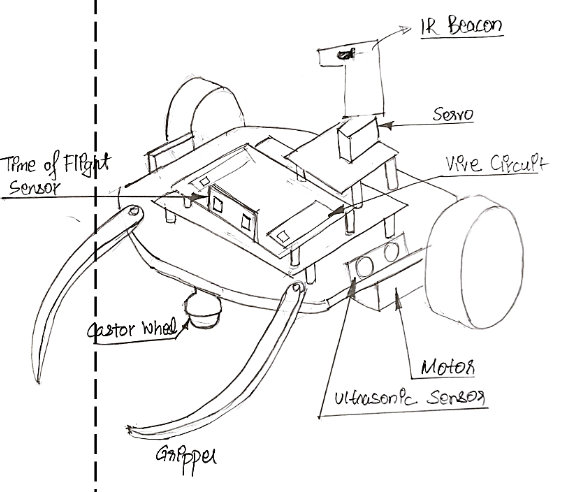
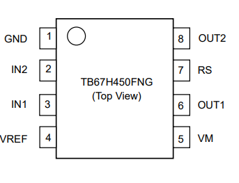

# MEAM5100_Final_Project_GTA
Repository for MEAM 5100 Course's FInal Project  - GTA (Grand Theft Autonomous)
Code repository for Team 25 - Anirudh Kailaje, Varun Viswanathan, Raghavesh Vishwanath

## Sensor List

1. Ultrasonic Ranging
        
    1. [HC-SR04](https://www.adafruit.com/product/3942)
        - Cost: $3.95
        - Range: 10cm – 250cm
        - Speed: ~10 samples/sec
        - Beam width: ~15 degrees
2. Time of Flight Distance Ranging
   
    1. [VL53L0X](https://www.adafruit.com/product/3317)
        - Cost: $14.95
        - Distance range: 5-120cm  

| Range | Sensor | Quantity | Seller |
|--|--|--|--|
| Short     | Ultrasonic            | 2 | Adafruit  |
| Long      | ToF Distance Ranging  | 1 | Pololu    |

## Actuator
1. SG90 Servo
1. DC TT Motor

## Base and Wheels

| Part | Cost |
|--|--|
| [Orange and Clear TT Motor Wheel for TT DC Gearbox Motor](https://www.adafruit.com/product/4678)  | $1.50 * 2 = $3.00 |

**NOTE** Designed for 1/4" MDF instead of the usual 1/8"

## TBH67H450 Motor Driver

1. The module has two direction control pins for each channel
    1. The IN1 and IN2 pins control the spinning direction of the motor
1. The spinning direction of a motor can be controlled by applying either a logic HIGH(5 Volts) or logic LOW(Ground) to these inputs
1. `IN1` and `IN2` are also used to turn the motors ON, OFF and control its speed
    1. Pulling pin high will make motor spin
    1. Pulling pin low will make motor stop
1. `OUT1` and `OUT2` are connected to the motor 
1. [Datasheet](https://toshiba.semicon-storage.com/info/TB67H450FNG_datasheet_en_20201126.pdf?did=65346&prodName=TB67H450FNG)

| Input 1 | Input 2 | Direction |
|--|--|--|
| Low(0) | Low(0) | Motor OFF 	|
| High(1) | Low(0) | Forward 	|
| Low(0) | High(1) | Backward 	|
| High(1) | High(1) | Motor Brake |

## Autonomous Behaviors

1. Follow the wall till you get to the can, pick it up and go back in reverse
1. Follow the beacon using a photo-reflective pair, pick up the can and follow a line on the way back
