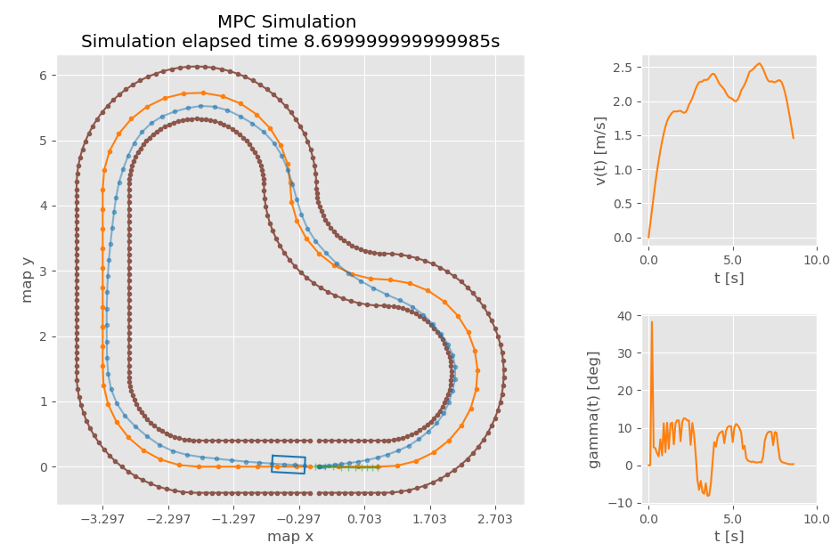
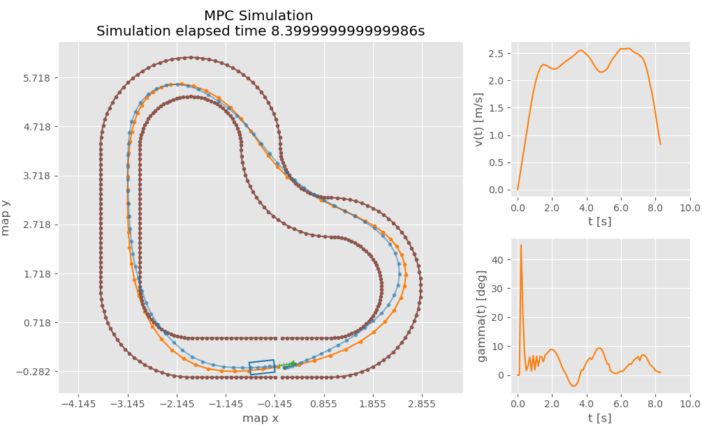

# Augmentation of Model Predictive Contouring Control using Learning-based Model Predictive Control
This mainly uses **[CVXPY](https://www.cvxpy.org/)** as a framework. This repo contains code from other projecs, check them out in the special thanks section.


### Usage
The packeges needed for running the code can be installed using pip

```
pip install cvxopt
pip install osqp
pip install pathos
```

Once the packages are installed,  from the src folder, run 

From within the `mpcc_python` directory:
```bash
main.py
```
 You can also download the LMPC_for_autonomous_racing folder and run the jupyter notebook
```bash
LMPC_for_autonomous_racing.ipynb
```
* To run the simulation-less demo (simpler demo that does not use pybullet, useful for debugging):
```bash
python3 mpc_demo_nosim.py
```

The script will promt the user for `enter` before starting the demo.

The settings for tuning the MPC controller are in the **[mpc_config](./mpc_pybullet_demo/mpcpy/mpc_config.py)** class.


### The Plant
The vehicle is modelled using the dynamics single track bicycle model and the tire forces are modelled using the Pacejka formula.

### The Path Following
1) Lap 1: a PID path following controller is used to drive the vehicle around the track.
2) Lap 2: the data from lap 1 are used to estimate a LTI model used to design a MPC for path following
3) Lap 3: the data from lap 1 are used to estimate a LTV model used to design a MPC for path following


### About
The Learning Model Predictive Control (LMPC) is a data-driven control framework developed at UCB in the MPC lab. In this example, we implemented the LMPC for the autonomous racing problem. The controller drives several laps on race track and it learns from experience how to drive faster.

<p align="center">

</p>

In the above animation we see the vehicle's closed-loop trajectory (in black) for laps 5, 30, 31 and 32. At each time instant the LMPC leverages forecast to plan the vehicle trajectory (in red) few seconds into the future. This trajectory is planned to minimize the lap time, but it is constrained to land into the safe set (in green). This safe set is the domain of the approximation to the value function and it is updated after each lap using historical data.


The MPCC is a model predictive path following controller which does follow a predefined reference by solving an optimization problem. The resulting optimization problem is shown in the following equation:


The terns of the cost function are the sum of the **reference tracking error**, **heading effort** and **actuaction rate of change**.

Where R,P,Q are the cost matrices used to tune the response.

The vehicle model is described by the bicycle kinematics model using the state space matrices A and B:


The state variables **(x)** of the model are:

* **x** coordinate of the robot
* **y** coordinate of the robot
* **v** velocuty of the robot
* **theta** heading of the robot

The inputs **(u)** of the model are:

* **a** linear acceleration of the robot
* **delta** steering angle of the robot


### Results

Results:

**Centerline as Reference**


**LMPC path as reference**



### Requirements


The dependencies for just the python scripts can also be installed using `pip`:
```bash
pip3 install --user --requirement requirements.txt
```

## References & Special Thanks :star: :
This code is based on the following:

* Ugo Rosolia and Francesco Borrelli. "Learning Model Predictive Control for Iterative Tasks. A Data-Driven Control Framework." In IEEE Transactions on Automatic Control (2017). [PDF](https://ieeexplore.ieee.org/document/8039204/)
* Ugo Rosolia and Francesco Borrelli. "Learning how to autonomously race a car: a predictive control approach." IEEE Transactions on Control Systems Technology (2019) [PDF](https://ieeexplore.ieee.org/abstract/document/8896988).
* Ugo Rosolia and Francesco Borrelli. "Learning Model Predictive Control for Iterative Tasks: A Computationally Efficient Approach for Linear System." IFAC-PapersOnLine 50.1 (2017). [PDF](https://arxiv.org/pdf/1702.07064.pdf)
* [Prof. Borrelli - mpc papers and material](https://borrelli.me.berkeley.edu/pdfpub/IV_KinematicMPC_jason.pdf)
* [AtsushiSakai - pythonrobotics](https://github.com/AtsushiSakai/PythonRobotics/)
* [alexliniger - mpcc](https://github.com/alexliniger/MPCC) and his [paper](https://onlinelibrary.wiley.com/doi/abs/10.1002/oca.2123)
