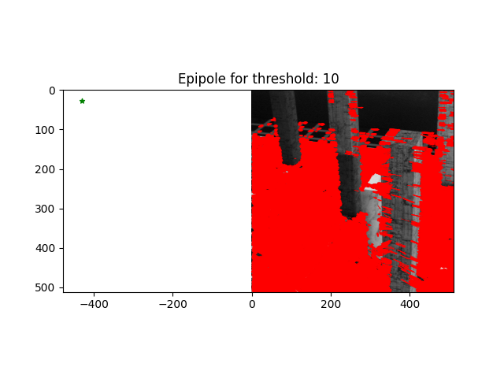
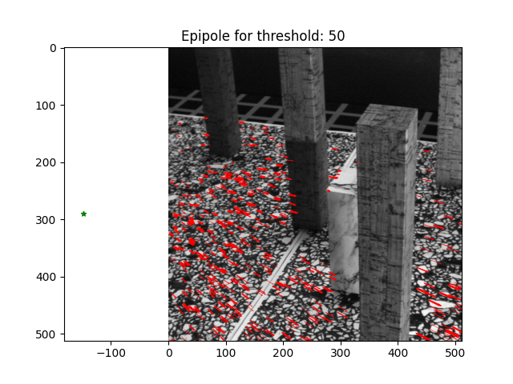

# Optical-Flow-Analysis-and-Depth-Estimation-in-Image-Sequences
This repository offers a comprehensive computer vision solution for in-depth optical flow analysis in image sequences. It encompasses various functionalities, including the computation of spatiotemporal derivatives, application of the Lucas-Kanade method for flow calculation, visualization of flow vectors with confidence metrics, determination of the epipole using RANSAC, and estimation of pixel depth. The provided Python functions enable the extraction of motion insights from image sequences, allowing users to delve into the intricacies of spatiotemporal changes.

## Key Features:

- **Spatiotemporal Derivatives Computation:** Uncover motion patterns within image sequences by computing spatiotemporal derivatives.

- **Optical Flow Field Creation:** Employ a meticulous approach to calculate optical flow vectors (u, v) for each pixel, supported by a confidence metric (smin).

- **Vector Field Visualization:** Dynamic plotting functions accommodate varying thresholds, ensuring precise and clear visualization of the optical flow vector field.

- **Epipole Calculation:** Utilize the RANSAC algorithm to determine the pixel position of the epipole, providing insights into optical flow and associated motion dynamics.

- **Pixel Depth Estimation:** Handle motion equations specific to planar scenes to estimate pixel depth accurately.

This repository serves as a valuable resource for advanced optical flow analysis, offering a range of functionalities for motion detection and understanding within image sequences.

### Threshold = 10:

### Threshold = 50:

- **Depth Mapping:** Transform pixel flow data, confidence metrics, and epipole values into depth insights at each pixel, visualized through a comprehensive depth map.
- 
### Threshold = 1:

### Threshold = 10:

### Threshold = 30:

- **Planar Scene Motion Analysis:** Advanced exploration of the motion exhibited by planar segments within the scene.

### Threshold = 1:

### Threshold = 10:

### Threshold = 30:

## Overview

This project amalgamates the foundations of optical flow analysis with advanced computational techniques to provide a holistic view of image sequence motions and associated depths. It is ideal for researchers, computer vision enthusiasts, and developers keen on harnessing the power of motion analysis.
