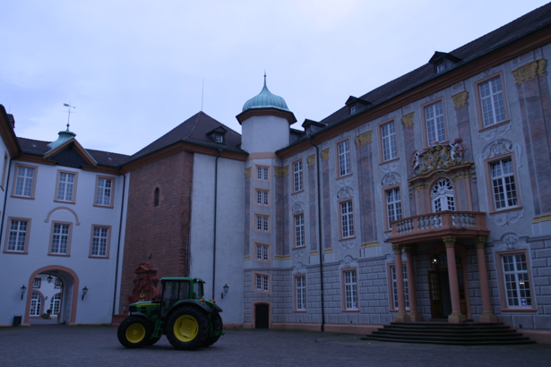
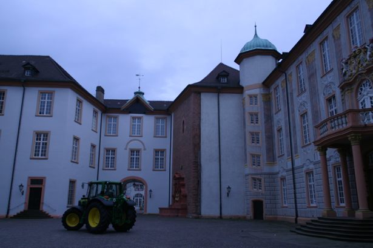

# 3D-Reconstruction-of-Architectural-Structures-from-Stereoscopic-Images
This repository focuses on creating a 3D model from two 2D images of a castle using advanced computer vision techniques.

## First image:

## Second image:

## Features

- **3D Transformation Estimation:** Computed the transformation between the two images.
- **Calibrated Projections:** Utilized known intrinsic camera parameters.
- **Essential Matrix Estimation:** Estimated the essential matrix using SIFT feature matches.
- **RANSAC Integration:** Employed RANSAC for a robust estimation of the transformation.

## SIFT FEATURES

- **Epipolar Geometry Visualization:** Plotted epipolar lines to visualize the correspondence between the two images.

- **Camera Pose Recovery:** Extracted the rotation and translation between the two camera positions.
- **3D Triangulation:** Triangulated the matched feature points to derive 3D points.
- **Reprojection Verification:** Confirmed the accuracy of the 3D reconstruction by reprojecting the 3D points onto the 2D images.

